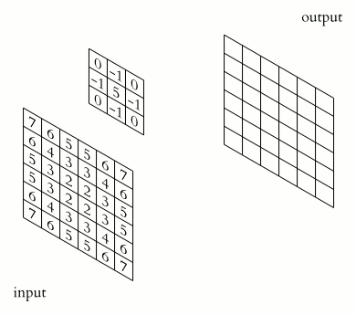
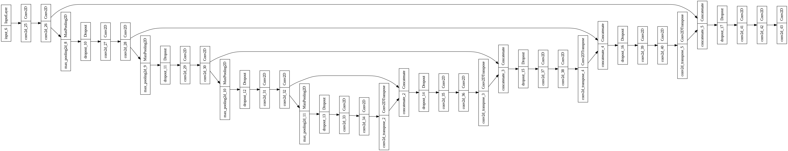

<h1>Semantic Segmentation using U-Net Architecture</h1>
<h2>Aim: </h2>
The aim of this project is to understand and implement semantic segmentation on a comparitively simple dataset. This knowledge and neural network can be used for transfer learning for much more complex semantic segmentation tasks like analysis seismic activity, medical imaging, self driving car optics, etc. The network architechture used in this project is called a U-Net. More on this network will be shown below.

<h2>About Semantic Segmentation: </h2>
Semantic segmentation is a computer vision task that involves classifying each pixel in an image into a specific category or class. Unlike object detection, which identifies and classifies objects as bounding boxes, semantic segmentation assigns a label to every pixel, effectively delineating the precise shape and boundary of each object in the image. This technique is crucial in applications requiring detailed image understanding, such as autonomous driving, medical imaging, and scene parsing. These results can be achieved through complex combinations of Convolutional Layers, Dense Layers, and Transpose Layers. Read below to get the details of these.

<h2>Step-by-step procedure: </h2>
<h3>Dataset: </h3>
The dataset used for this project is the Pets dataset from <a href="https://www.robots.ox.ac.uk/">Oxford IIIT website.</a> This dataset contains images of pet dogs and cats. These images are categorized by breeds and there are about 200 examples per category. Furthermore, with each image comes it's true masked image. These masked images are used as target labels and used to train a supervised learning model. In the dataset, there are in total 3680 training examples and 3669 test examples. Moreover, the dataset can be directly downloaded by using the tensorflow_datasets library. More information on the dataset can be found on the official site: <a href="https://www.robots.ox.ac.uk/~vgg/data/pets/">Pets Dataset.</a> This is one example image and it's mask from the dataset.

<h3>Data Preprocessing: </h3>
I preprocessed the data in three steps. First, I resized the images into a smaller 128 by 128 pixels. Then, I randomly picked images and flipped them left and right to generate more diverse data. Then, a common step in image processing before feeding them to a Neural Network is normalizing the pixels between -1 and 1 by dividing each pixel value by 255 (Max intensity value). The final dimensions of the input images is (128,128,3) and the true mask images is (128,128,1). Furthermore, I decided to split the data into Train-> 3680, Validation-> 3000 and Test-> 669 data points.

<h3>Convolutional Neural Networks: </h3>
A Convolutional Neural Network (CNN) is a type of deep learning algorithm specifically designed for processing and analyzing visual data. CNNs are widely used in image recognition, computer vision, and various other tasks involving visual inputs due to their ability to automatically and adaptively learn spatial hierarchies of features from images. These networks are comprising of convolutional layers as the main computational units. The main advantage of such layers is that they greatly reduce the number of parameters to be trained while efficiently capturing image features. 
You can view the following animation to get an idea on how convolutional layers work.

<h3>Transpose Convolution: </h3>
Transpose Convolution is a very important concept if we want to build U-Nets. Typically, a Convolution Layer downsamples an image and lowers it's dimensions. A transpose convolution is used to upsample the input and increase the dimensions of the image. This following animation will give a brief idea about Transpose Convolutions.

<h3>U-net Architecture: </h3>
Finally, we can use the above 2 concepts to build a U-Net architecture. The reason why it is called a U-Net is because the network looks like a "U". In a U-Net, in the left half, Convolutional Layers are implemented with MaxPooling Layers. This downsamples the images. This downsampling enables the network to learn about the features of the image in a much detailed level. However, due to this, we will lose the original size and large scale details of the image. That is why the right half of the U-net consists of Transpose Layers. These transpose layers upsample the output, and to retain the original properties of the image, some skip connections are added as you will see in the diagram of the U-Net. This below diagram is the U-Net used in this project.

<h3>Output: </h3>
Below are some of the masks that our U-net is able to produce.

